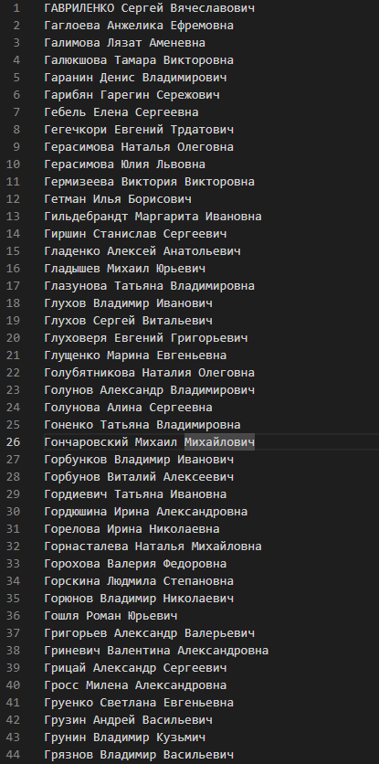

# Лабораторная работа №1
## Задание
Получить список сотрудников ОмГТУ, фамилия которых начинается с первой буквы вашей фамилии, результат записать в файл

## Решение
Программа получает на вход символ - первую букву фамилии, а затем записывает результат в файл _employees.txt_

Для защиты от "дурака" используется декоратор, в котором берется первый символ введенной строки

