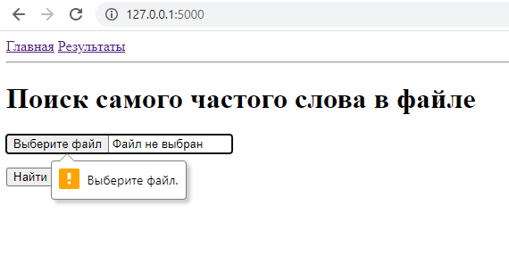

# Лабораторная работа 3 / 4
## Задание 1
Разработать веб-приложение, на котором можно осуществлять поиск самого частого слова в файле

## Решение
Для создания веб-приложения использовалась библиотека _flask_

Главное окно приложения представлено ниже

Форма для заполнения данных реализована при помощи библиотеки _flaskwtf_.
Форма поддерживает валидацию данных, поэтому нельзя загрузить пустой или не .txt файл

Приложение поддерживает 2 страницы, располагающихся на endpoints **(/ или /index)** и **/result**.
Страницы используют шаблон

При попытке перейти на страницу **/result**, не загрузив при этом ни один файл, страница ответит таким результатом

При попытке загрузить такие файлы как
1) null.txt - пустой файл
2) test1.txt - 

3) test2.txt - 

Результат будет представлен ниже

## Задание 2
Написать unit тесты для веб-приложения

## Решение
При написании тестов использовалась библиотека _unittest_

**Список тестов**

1) **test_couting_in_empty_file**: проверка на подсчет самого частого слова в пустом файле;

2) **test_couting_with_different_registers**: проверка на подсчет самого частого слова, написанного разным регистром

3) **test_correct_code_responces**: проверка на корректность получаемых кодов ответа

4) **test_get_result_page_in_first_time**: проверка корректности полученного результата при первом посещении страницы /result

Результат работы тестов представлен ниже

